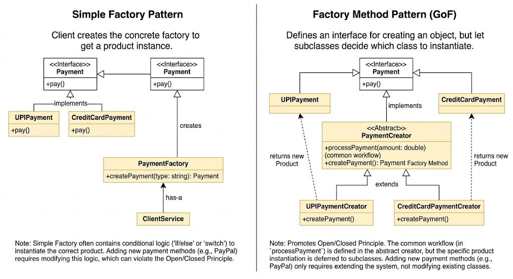
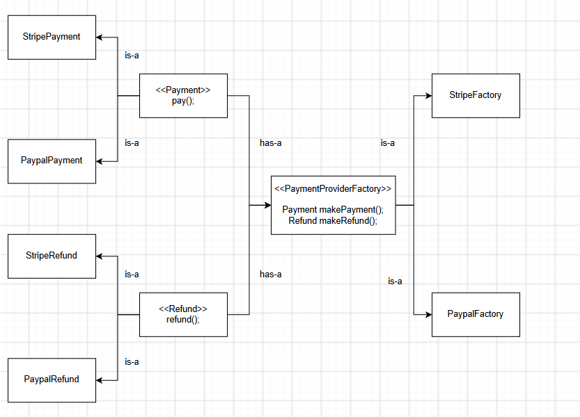
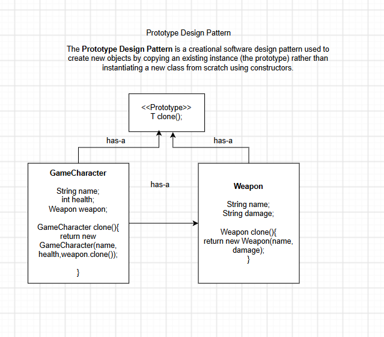

# LLD
## Creational Design Patterns
### Factory Design Pattern
* **Factory Pattern** encapsulates object-creation logic and hides
the concrete implementation classes from the client.

### Abstract Factory Design Pattern
* **Abstract Factory** is used to group the similiar type of products under one factory so that factory will handle the object creation logic.

### Prototype Design Pattern
* The **Prototype Design** Pattern is a creational software design pattern used to create new objects by copying an existing instance (the prototype) rather than instantiating a new class from scratch using constructors.
